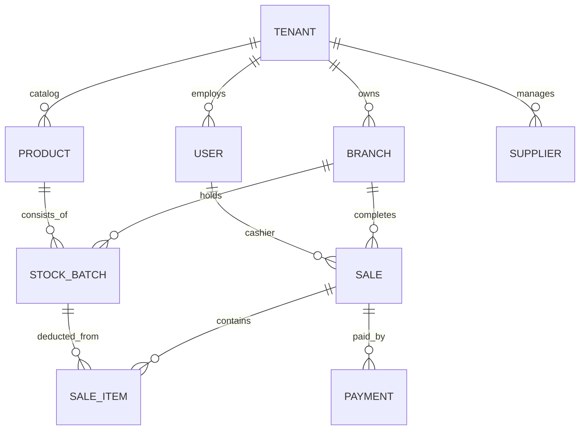
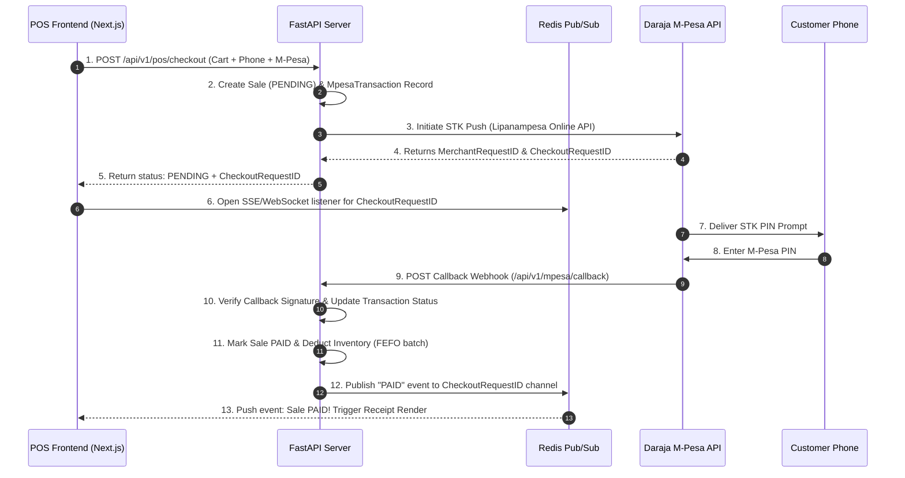
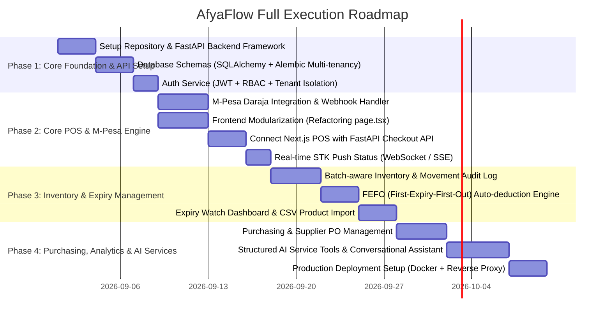

# Comprehensive Technical Execution Blueprint & Master Plan
## Pharma - SaaS Pharmacy POS & AI Business Operating System

**Date:** 2026-08-31  
**Project Name:** Pharma (Pharmacy Operating System & POS)  
**Target Market:** Kenyan growth-stage retail pharmacies and chemists  

---

## 1. Executive Summary & Vision

Pharma is a modern, multi-tenant SaaS Pharmacy Point of Sale (POS) and Business Operating System. It is built to resolve the critical operational bottleneck of retail pharmacies: **instant, cashier-frictionless M-Pesa STK Push payment processing directly at the point of sale, integrated with real-time batch-aware inventory, expiry tracking, and structured financial intelligence.**

### Long-Term Architectural Flywheel
```text
POS Fast Checkout & Cashier Operations
  ↓
Real-Time Transaction & M-Pesa Callback Ledger
  ↓
Batch-Aware Inventory (FEFO) + Customer & Supplier Records
  ↓
Structured Business Intelligence & Financial Services Layer
  ↓
AI Business Assistant (Deterministic Function Calling Tools)
```

---

## 2. Technical Stack & Infrastructure Architecture

### 2.1 Technology Stack Choice
* **Frontend Application (`/apps/web` or `/Pharma`):**
  * Framework: Next.js 16 (React 19, TypeScript 5.7)
  * Styling: Vanilla CSS / Modern Tailwind CSS v4 design system with CSS custom properties
  * Icons: `lucide-react`
  * State Management: Zustand (client-side POS offline cache, reactive cart, active register state)
* **Backend Core API (`/services/api`):**
  * Framework: FastAPI (Python 3.12, AsyncIO)
  * Database ORM / Migrations: SQLAlchemy 2.0 (Async) + Alembic
  * Security & Auth: PyJWT (JWT tokens with Tenant ID claims), Passlib (Argon2id / bcrypt hashing)
* **Database & Caching Layer:**
  * Database: PostgreSQL 16 (Multi-tenant schema / row-level security isolation)
  * Cache & Event Queue: Redis 7.2 (Session storage, M-Pesa callback state pub/sub, background task queue with Celery/ARQ)
* **Integrations:**
  * Safaricom Daraja 2.0 API (M-Pesa Express / STK Push, Callback Webhooks, Query APIs)

### 2.2 System & Repository Structure
```text
POS/
├── PharmaIdea                      # Original Product Brief & Specifications
├── EXECUTION_PLAN.md               # Master Project Execution Plan
├── Pharma/                          # Next.js 16 Frontend Web Application
│   ├── app/                         # App Router (Overview, POS, Products, Inventory, etc.)
│   ├── components/                  # Modular UI components (POS Grid, Cart, Payment Prompt)
│   ├── lib/                         # API Client, Zustand Stores, Offline Cache Sync
│   └── package.json
└── services/                        # Python Backend Services
    └── api/
        ├── app/
        │   ├── main.py              # FastAPI Application Entrypoint
        │   ├── core/                # Config, Security, Database connection
        │   ├── models/              # SQLAlchemy Data Models (Tenant, User, Product, Batch, Sale, Payment)
        │   ├── schemas/             # Pydantic Schemas for Validation & Serialization
        │   ├── api/v1/endpoints/    # API Routes (auth, pos, mpesa, inventory, analytics)
        │   └── services/            # Core Business Logic & AI Tools
        └── alembic/                 # Database Migrations
```

---

## 3. Database Architecture & Multi-Tenancy Strategy

Every model includes a `tenant_id` foreign key for strict tenant isolation. Row-Level Security (RLS) policies and FastAPI request-scoped dependency injection ensure queries are automatically scoped to the logged-in tenant.



### Core Schema Definitions

#### 1. Tenants & Users
* **`tenants`**: `id` (UUID), `name` ("ABC Chemist"), `slug`, `plan` (FREE, PRO, ENTERPRISE), `is_active`, `created_at`
* **`branches`**: `id` (UUID), `tenant_id`, `name` ("Westlands Branch"), `code`, `location`
* **`users`**: `id` (UUID), `tenant_id`, `branch_id`, `email`, `hashed_password`, `full_name`, `role` (`OWNER`, `MANAGER`, `CASHIER`), `is_active`

#### 2. Products, Batches & Inventory
* **`products`**: `id` (UUID), `tenant_id`, `sku`, `barcode`, `name`, `generic_name`, `category`, `unit`, `reorder_level`, `selling_price`, `buying_price`, `tax_rate`
* **`stock_batches`**: `id` (UUID), `tenant_id`, `branch_id`, `product_id`, `batch_number`, `manufacture_date`, `expiry_date`, `quantity_initial`, `quantity_remaining`, `unit_cost`
* **`inventory_movements`**: `id` (UUID), `tenant_id`, `branch_id`, `product_id`, `batch_id`, `movement_type` (`SALE`, `PURCHASE`, `ADJUSTMENT`, `EXPIRED`, `RETURN`), `quantity`, `reference_id`, `created_by`

#### 3. Sales & Payments (M-Pesa Focused)
* **`sales`**: `id` (UUID), `tenant_id`, `branch_id`, `cashier_id`, `receipt_number`, `subtotal`, `discount`, `tax_amount`, `total_amount`, `payment_status` (`PENDING`, `PAID`, `CANCELLED`, `FAILED`), `created_at`
* **`sale_items`**: `id` (UUID), `sale_id`, `product_id`, `batch_id`, `unit_price`, `quantity`, `total_price`
* **`mpesa_transactions`**: `id` (UUID), `tenant_id`, `sale_id`, `merchant_request_id`, `checkout_request_id`, `phone_number`, `amount`, `mpesa_receipt_number`, `result_code`, `result_desc`, `status` (`PENDING`, `SUCCESS`, `FAILED`, `CANCELLED`, `TIMEOUT`), `raw_callback_payload` (JSONB)

---

## 4. Primary Workflow Architecture: M-Pesa STK Push Integration



### Idempotency & Error Handling Strategy
* **Duplicate Callback Guard:** Webhook checks if `mpesa_receipt_number` or `checkout_request_id` has already been processed to prevent double inventory deduction.
* **Timeout & Fallback:** Cashier interface includes an auto-polling fallback query endpoint `GET /api/v1/mpesa/status/{checkout_request_id}` in case WebSocket/SSE connection drops.
* **Failure Handling:** If customer cancels or enters wrong PIN, callback updates transaction to `CANCELLED`/`FAILED`, unlocks cart in POS UI, and provides immediate clear error feedback.

---

## 5. UI/UX Design & Frontend Integration Strategy

### 5.1 Frontend Navigation & Views
The existing prototype (`/app/page.tsx`) provides the base shell. We will modularize it into structured sub-pages under Next.js App Router:
* `/app/overview` — Executive KPIs, sales trend chart, expiry watch, payment breakdown
* `/app/pos` — High-speed barcode/search checkout interface, cart management, instant M-Pesa STK trigger, thermal receipt printer integration
* `/app/products` — Product catalog, barcode generation, unit pricing
* `/app/inventory` — Batch management, stock receipts, stock adjustment logs
* `/app/purchasing` — Supplier Purchase Orders & stock receiving
* `/app/reports` — Daily sales ledgers, gross profit analysis, tax/VAT reports
* `/app/ai-assistant` — Conversational natural-language query interface

### 5.2 POS Speed & Offline Resilience
* **Local Caching:** Product catalog and active categories cached in browser IndexedDB/LocalStorage via Zustand.
* **Optimistic Local Cart:** Instant responsiveness when adding/modifying cart items without waiting for server response.
* **Connectivity Indicator:** Header displays active register connectivity status (`Register 01 · Online/Offline`).

---

## 6. AI-Ready Business Operating Architecture

Rather than passing raw database schemas to an LLM, the backend exposes **deterministic, strictly typed business service functions** that can be executed directly as tools by AI agents.

### Core Exposed AI Tools
1. `get_daily_sales_summary(tenant_id, date_range)` -> Sales, M-Pesa vs Cash, Gross Profit
2. `get_expiring_stock_report(tenant_id, days_threshold)` -> List of batches expiring within N days
3. `get_low_stock_items(tenant_id)` -> Products below minimum reorder thresholds
4. `get_product_profit_margins(tenant_id, category)` -> Margin analysis per item
5. `reconcile_mpesa_discrepancies(tenant_id, date)` -> Mismatched transactions audit

---

## 7. Step-by-Step Execution Plan



### Detailed Execution Tasks

#### Task 1: Initialize Backend Structure & Database Models
* Setup FastAPI project inside `/services/api`.
* Write SQLAlchemy async models for `Tenant`, `User`, `Product`, `StockBatch`, `Sale`, `SaleItem`, and `MpesaTransaction`.
* Initialize Alembic migrations script.

#### Task 2: Build M-Pesa Daraja 2.0 Integration Service
* Implement OAuth token generator for Safaricom Daraja API.
* Implement `initiate_stk_push()` sending prompt to customer mobile.
* Build public secure callback endpoint `/api/v1/mpesa/callback` with signature validation.
* Integrate Redis Pub/Sub for real-time notification to the frontend.

#### Task 3: Refactor Next.js Frontend Shell (`/Pharma`)
* Split monolithic `app/page.tsx` into clean, maintainable modular components (`components/pos/`, `components/dashboard/`, `components/ui/`).
* Setup Axios/Fetch API client with JWT header injection.
* Connect M-Pesa STK push UI with live backend endpoints.

#### Task 4: Implement FEFO Batch Inventory Engine
* Create automated batch selection logic: when selling a product, auto-deduct stock from the batch nearest to expiry date.
* Log every inventory adjustment into `inventory_movements` for 100% auditability.

#### Task 5: AI Assistant Function Calling Layer
* Build structured API service functions under `app/services/ai_tools.py`.
* Hook tools to AI assistant backend endpoint `/api/v1/ai/query`.

---

## 8. Definition of Success & Acceptance Criteria

1. **POS Speed:** Cashier can select items, hit M-Pesa STK Push, and receive confirmation in under 5 seconds upon user PIN entry.
2. **Payment Accuracy:** 0% payment status mismatches between Safaricom M-Pesa callbacks and POS sale state.
3. **Data Security:** Strict multi-tenant isolation tested and validated—no tenant can read or mutate another tenant's records.
4. **Audit Readiness:** Every single stock movement and price edit is recorded with timestamp, user ID, and batch reference.
